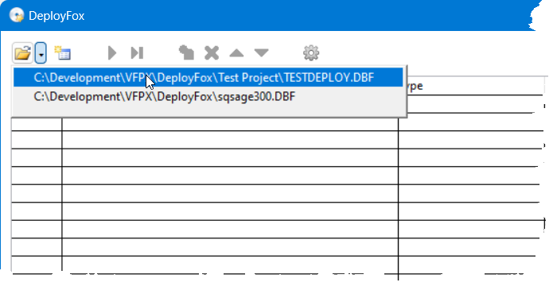

# VFPX Framework Documentation

## Base classes
VFPXBaseLibrary.vcx contains subclasses of most VFP base classes.  Common changes are (not all changes are applicable to all classes):

* Anchor (VFPXBaseContainer, VFPXBaseEditBox, VFPXBaseGrid, VFPXBasePageframe): 15 (resize horizontally and vertically)

* AutoSize: .T.

* BackStyle: 0-Transparent

* BorderWidth (VFPXBaseContainer and VFXBaseOptionGroup): 0

* BoundTo and ItemTips (VFPXBaseComboBox and VFPXBaseListBox): .T.

* Builder: the name of a builder (specified as *BuilderName.prg* or *BuilderLibrary,BuilderClass*) to use for the class.

* BuilderCode: code for a self-container builder; see the notes in the method for instructions to use.
    
* Enabled_Assign (VFPXBaseContainer and VFPXBasePage): sets the Enabled property of all contained controls to the same value.

* FontName: Segoe UI

* InteractiveChange and ProgrammaticChange: call UpdateControlSource to write the control's value to its control source, then call AnyChange. Put code in AnyChange that should be called on any change (programmatic or interactive) to the control's value.

* IntegralHeight: (VFPXBaseEditBox and VFPXBaseListBox): .T.

* KeyPress: prevent Ctrl-0 from inserting a null value and backspace from leaving the control.

* RightClick: calls This.ShowMenu, which instantiates an SFMenuShortcutMenu object into the oMenu property (this requires the VFPX [OOPMenu project](https://github.com/VFPX/OOPMenu) be installed, which is automatically done if you use [FoxGet](https://github.com/DougHennig/FoxGet) to install VFPX Framework) and calls ShortcutMenu to populate the shortcut menu. See the code in  VFPXBaseTextBox.ShortcutMenu for an example of how to populate a shortcut menu.

* RowSource and RowSourceType (VFPXBaseComboBox and VFPXBaseListBox): This.aItems and 5-Array, respectively. If the lRequeryOnInit property is .T. (the default), populate the This.aItems array in Init and then call DODEFAULT() to requery the control.

* SelectOnEntry: .T.

* lSaveAnchor: set this to .T. before programmatically changing the Top, Left, Height, or Width properties of the control to ensure anchoring is handled properly, then set it to .F. afterward.

Changes in specific classes:

* VFPXBaseComboBox:

    * Style: 2-Dropdown List
    
    * lAddNewItemToList: if .T., Style is 1-Dropdown Combo, RowSourceType is 5-Array, and RowSource is This.aItems, values entered by the user that don't exist in the array are automatically added to it by the Valid method.

* VFPXBaseForm:

    * AllowOutput: .F.
    
    * AutoCenter: .T.
    
    * BackColor: 255,255,255 (white)
    
    * Desktop: .T.
    
    * KeyPress: close the form on Esc.
    
    * KeyPreview: .T.
    
    * Load: set the environment (e.g. SET DELETED ON) for forms with a private datasession
    
    * MaxButton and MinButton: .F.
    
    * ShowTips: .T.
    
    * ShowWindow: 1-In Top-Level Form

* VFPXBaseGrid:

    * Builder: VFPXGridBuilder.prg; see the VFPXGridBuilder section below.
    
    * BuilderCode: calls SetupGrid, passing _cliptext.
    
    * SetupGrid: sets up the grid using the specified column definitions; see comments in that method for instructions to use.

* VFPXBaseOptionGroup:

    * MemberClass and MemberClassLibrary: VFPXBaseOptionButton in VFPXBaseLibrary.vcx

* VFPXBasePageFrame:

    * MemberClass and MemberClassLibrary: VFPXBasePage in VFPXBaseLibrary.vcx
    
    * PageCount: 1
    
    * TabStyle: 1-Justified

* VFPXBasePage:

    * Activate: calls This.Refresh.

* VFPXBaseShape:

    * SpecialEffect: 0-3D

## VFPXBaseLibrary.h

VFPXBaseLibrary.h contains some commonly used constants.

## VFPXGridBuilder

Grids can be a pain to set up, especially if you later need to add a column between two existing columns. VFPXGridBuilder provides an easy way to define the columns of a grid by using a format definition.

The easiest way to specify the format definition is to put it between TEXT and ENDTEXT statements in some method of the grid, such as Init. You then copy the text (not including the TEXT and ENDTEXT statements) and invoke the builder. Alternatively, put the definition into a custom GridDefinition of the grid (VFPXBaseGrid has such a method) and return the definition string from that method. Then there's no need to copy it to the clipboard before invoking the builder.

To invoke the builder, if you're using a VFPXBaseGrid object, right-click the grid and choose Builder. For any other type of grid, select the grid and run VFPXGridBuilder.prg.

Here's an example of a format definition:

```
text to lcFormat noshow
Field     |Width  |Caption    |Alignment  |InputMask  |Format  |ReadOnly  |Control
Invnum    |70     |Invoice #  |           |           |        |.T.       |
Date      |70     |Date       |           |           |        |.T.       |
Name      |*      |Project    |           |           |        |.T.       |
Amount    |60     |Amount     |R          |99,999.99  |        |.T.       |
Paid      |70     |Paid       |           |           |        |          |Checkbox
DatePaid  |70     |Date Paid  |           |           |        |          |
Received  |60     |Received   |R          |99,999.99  |        |          |
endtext
```

Here's some information about the format definition:

- It must have a header row like in the example.

- The supported settings are Field (the ControlSource), Width, Caption, Alignment, InputMask, Format, ReadOnly, and Control.

- The order of the settings is unimportant (the setting names are read from the header) and all but Field and Caption are optional.

- Separate columns with tabs and a pipe character.
    
- Use an empty setting for an unspecified value.
    
- Use "*" for Width to "auto-size" a column; that is, size it to the rest of the space after the other columns are sized.
    
- Alignment can be specified as 0 or L for left, 1 or R for right, and 2 or C for center.

- If Control isn't specified, a Textbox is used. Otherwise, the specified class is used. Currently only Checkbox, CommandButton, and Combobox are supported for Control.

## Specialty classes

### Sortable grid
Use VFPXSortGrid (in VFPXSortGrid.vcx) to allow the user to click a column header to sort on that column. VFPXSortGrid, which is a subclass of VFPXBaseGrid, allows sorting on any column that has as a ControlSource a field in a cursor or table that has a tag with the same name as the field. The header of the sorted column displays a down arrow for ascending order or an up arrow for descending order.

### Persistent form
Users appreciate a form that opens in the same position and size as it was last time it was open. VFPXPersistentForm in VFPXPersistentForm.vcx provides this ability. Create a form based on VFPXPersistentForm and set the cRegistry property to the Windows Registry location in HKEY_CURRENT_USER to save the window settings (for example, "Software\MyApp") in either the Properties window or in the Load or Init methods (in the case of Init, set it prior to calling DODEFAULT()). VFPXPersistentForm has a VFPXPersist object.

Alternatively, add a VFPXPersist object to any form and set its cRegistry property to the Windows Registry location in HKEY_CURRENT_USER to save the window settings.

VFPXPersist uses SFMonitors.prg (discussed below) to size and position the form properly, including ensuring it fits on the correct monitor. For example, if the user has two monitors, the form was opened on the second monitor before, but now only one monitor is available, the form is opened on the correct monitor and sized and positioned appropriately. It also uses VFPXRegistry (discussed below) to read from and write to the Registry.

VFPXPersist supports persisting other settings in addition to size and position. Dimension the aPersist array to one row per setting and two columns; this should be done prior to calling the Restore method. The first column contains the Registry key to use and the second is the name of the property to persist. For example, to save and restore the cFileName property of the form, use this code in the Init method of the form:

```
dimension This.oPersist.aPersist[1, 2]
This.oPersist.aPersist[1, 1] = 'FileName'
This.oPersist.aPersist[1, 2] = 'Thisform.cFileName'
This.oPersist.Restore()
  && or DODEFAULT() if using VFPXPersistentForm
```

Note this code specifies the cFileName property as belonging to "Thisform" since that property is referenced in the context of the VFPXPersist object.

### Button with dropdown menu
VFPXDropDownMenuButton in VFPXDropDownMenuButton.vcx provides a button with a dropdown menu, sometimes called a "split" button. Drop one on a form, set Picture property of the cmdMain button as desired, fill in the ShortcutMenu method of the VFPXDropDownMenuButton object as necessary, and put code into the ButtonClicked method that executes when the user clicks the button.

For example, [DeployFox](https://github.com/DougHennig/DeployFox) has a VFPXDropDownMenuButton allowing you to either click the button to open a project or select from a dropdown list of previously opened projects.



The ShortcutMenu method populates the list with previously opened projects (see the Maintaining MRU Lists section below for how the list of projects is saved):

```
lparameters toMenu, ;
    tcObject
local laProjects[1], ;
    lnProjects, ;
    lnI, ;
    lcProject, ;
    lcCommand
lnProjects = Thisform.oEngine.oRecentProjects.GetItems(@laProjects)
for lnI = 1 to lnProjects
    lcProject = laProjects[lnI, 1]
    lcCommand = '_screen.ActiveForm.OpenProject([' + lcProject + '])'
    toMenu.AddBar(lcProject, lcCommand)
next loProject
dodefault(toMenu, tcObject)
```

The ButtonClicked method prompts the user to select a project and then opens it (see the File Dialogs section below for information about GetFileName):

```
local lcProject
lcProject = GetFileName('DeployFox Project (*.dbf):dbf', '', 'Select DeployFox Project')
if not empty(lcProject)
    Thisform.OpenProject(lcProject)
endif not empty(lcProject)
```

## Running an executable
While the VFP RUN command runs an executable, it provides little control. API_AppRun.prg by the late Ed Rauh provides a much better way to run an executable:

* It can either run the EXE and wait for it to terminate or run it and return immediately.

* It can return a value indicating whether the EXE succeeded or not.

* It can display the EXE run in a normal, minimized, or maximized window or display no window at all.

ExecuteCommand.prg is a wrapper for API_AppRun. Pass it up to three parameters:

* The command line to execute (required). Use double quotes around the EXE path and any parameters if they contain a space or other illegal command line character.

* The folder to set as the current folder for the EXE (it doesn't change the current folder for your VFP app). Optional: if it isn't specified, the current folder is used.

* The window mode: NOR (normal), MIN (minimized), Max (maximized), or HID (hidden). Optional: HID is used if not specified.

It runs the EXE and waits until it terminates, then returns a blank string if the EXE succeeded or an error message if not (not all EXEs support reporting an error code).

Here's an example of using ExecuteCommand, adapted from VFPXInternet.prg (discussed in the Uploading and Downloading Files section below):

```
lcCommand = 'curl.exe -o "' + tcLocalFile + '" -L ' + ;
    iif(empty(tcServer), '', 'ftp://' + tcServer + ;
    iif(right(tcServer, 1) = '/' or left(tcRemoteFile, 1) = '/', '', '/')) + ;
    tcRemoteFile + iif(empty(tcUserName), '', ' -u ' + tcUserName + ':' + ;
    tcPassword)
lcMessage = ExecuteCommand(lcCommand, , 'HID')
llReturn  = empty(lcMessage)
if not llReturn
    This.cErrorMessage = lcMessage
endif not llReturn
```

## File and folder operations

### Move, copy, delete, or rename files and folders
VFP has commands to do all these operations but:

* No dialog is displayed if there are a lot of files (or large files) to move or copy.
* They aren't recursive; that is, they don't support a folder and its subdirectories.
* The VFP RD command throws an error if the folder isn't empty.

FileOperation.prg, adapted from code written by Sergey Berezniker, is a better way to perform these operations. Pass it up to six parameters:

* Source: the file or folder to copy, move, delete, or rename. Required.

* Destination: the file or folder to copy or move the source to. Optional for a delete operation, required for the others.

* Operation: the action to perform: "move", "copy", "delete", or "rename". Required.

* UserCanceled: optionally passed a variable by reference; upon return, it contains .T. if the user canceled the operation.

* Files only: optionally pass .T. to process file not folders.

* Quiet: optionally pass .T. to not display a dialog.

FileOperation returns .T. if the operation succeeded or the user canceled. It uses ClsHeap.prg.

Here's an example:

```
llReturn = FileOperation(lcSource, lcTarget, 'copy')
llReturn = FileOperation(lcSource, '', 'delete')
```

### Opening a file
OpenFile.prg is a wrapper for the Windows API ShellExecute function. Pass it the path to the file to open and it'll open the file using the appropriate application (for example, a DOCX file is opened in Microsoft Word and a URL is opened in the default browser).

Here's an example:

```
OpenFile('c:\myfolder\myfile.pdf')
```

### File and path case
Some VFP functions, such as FULLPATH(), uppercase the specified path. That's fine if it isn't displayed to the user or used to create a file, but it looks odd otherwise. Call GetProperFileCase.prg, passing it the path and optionally .T. if the path is a folder rather than a file, and it'll return the case of the file or folder as it actually is or lowercase if it doesn't exist. This uses the Windows Scripting.FileSystemObject so that has to be enabled (it is by default).

Here's an example:

```
lcFileName = GetProperFileCase(fullpath('myfile.pdf'))
```

### Getting files in a folder and all subdirectories
ADIR() only fills an array with information about the files in the specified folder. GetFilesInFolder fills an array with all files  in the specified folder and all subdirectories. It turns the number of files found. The array contains a single column with the full path for the filename.

## File dialogs
The VFP GETFILE() and PUTFILE() functions have a *lot* of shortcomings. Here are just a few:

* They return the path in uppercase.
* They don't support multi-file selection.
* They are older dialogs that don't support all the features of newer ones.
* They don't support a default folder.

The VFPXCommonDialog class in VFPXCommonDialog.vcx is a customized version of the _ComDlg class in the FFC _system.vcx (for example, it's easier to call because you don't have to pass parameters by reference). Because it uses the standard Windows file dialog, the dialog's appearance and behavior always matches the version of Windows it's running on. It has a lot of properties that allow you to customize the appearance and behavior; see the "Common Dialog Box Foundation Class" topic in VFP help for information about them.

GetFileName.prg is a wrapper for VFPXCommonDialog. Pass it up to five parameters:

* File extensions: the same value as the extensions parameter for GETFILE(). Optional: if it isn't specified, all file types are allowed.

* Default file path: optional. If passed the folder for the file is used as the default folder and the filename textbox in the dialog is filled in with the filename.

* Dialog title caption: optional; if not specified, the caption is "Open" or "Save", depending on the value of the next parameter.

* .T. for a Save dialog, .F. or not specified for an Open dialog.

* .T. to allow multiple files to be selected, .F. or not specified for a single file.

It returns a comma-separated list of files the user chose or blank if they clicked Cancel.

Here's an example:

```
lcProject = GetFileName('DeployFox Project (*.dbf):dbf', '', 'Clone Project', .T.)
```

### File and folder controls
VFPXGetFile and VFPXGetFolder are button classes in VFPXFileCtrls.vcx.

Drop a VFPXGetFile on a form, set its properties, and when the user clicks the button, a file dialog appears. Specify the control source for the control in the cResult property. If you want a method or function to execute after file selection, specify its name in the cAfterDone property. VFPXGetFile uses GetFileName.prg and VFPXCommonDialog.vcx.

VFPXGetDir is similar but it displays a folder selection dialog using GETDIR().

VFPXFile and VFPXDirectory combine a label, a textbox, and a VFPXGetFile or VFXGetDir button into a container. Both have builders (VFPXFileBuilder.prg and VFPXDirectoryBuilder.prg, but also self-contained code fired by double-clicking the Builder property in PEM Editor) that prompt for the caption of the label and adjust the position and size of the textbox and button. Both classes use SFMonitors.prg (discussed below) and SFGDIMeasureString.prg, and require System.app to be deployed with the application.

## Reading from and writing to INI files
ReadINI.prg and WriteINI.prg allow you to read from and write to INI files.

ReadINI accepts these parameters:

* tcINIFile: the INI file to look in
* tcSection: the section to look for
* tuEntry: the entry to look for (pass 0 and taEntries to enumerate all entries in the section)
* tcDefault: the default value to use if the entry isn't found (optional: an empty string is used if not passed)
* taEntries: an array (passed by reference) to hold all entries in the section (only needed if tuEntry is 0)

If tuEntry is a string (the entry), ReadINI returns the value of the entry (if it begins with 0x, indicating it's stored as hexBinary, it's converted back to a normal string) or tcDefault if the entry isn't found. If tuEntry is 0, ReadINI returns the number of entries in the array and the array is filled with the names of the entries.

Here's an example:

```
lcValue = ReadINI('MyFile.ini', 'Settings', 'MySetting')
```

WriteINI accepts these parameters:

* tcINIFile: the INI file to look in
* tcSection: the section to look for
* tuEntry: the entry to look for (pass NULL to remove the section)
* tuValue: the value to store (pass NULL to remove the entry)

If the value contains any binary characters, it's written out as "0x" + the value converted to hexBinary because binary values may not be read in correctly. Logical values are converted to Y or N and other non-string values are converted to strings. WriteINI returns .T. if the value was written to the INI file.

Here's an example:

```
WriteINI('MyFile.ini', 'Settings', 'MySetting', 'My value')
```

## Reading from and writing to the Windows Registry
VFPXRegistry in VFPXRegistry.vcx provides methods to read from and write to the Windows Registry. It uses VFPXRegistry.h, which includes VFPXBaseLibrary.h.

You may be wondering why not just use the FoxPro Foundation Classes (FFC) _Registry.vcx. There are several advantages of VFPXRegistry over _Registry, but the main ones are that you don't have to pass parameters by reference and it supports types other than just strings, including binary values, DWORD, and multi-string values.

Many of the VFPXRegistry methods accept a hive parameter, the section of the Registry such as HKEY_CURRENT_USER. Pass one of the cnHKEY constants in VFPXRegistry.h, such as cnHKEY_LOCAL_MACHINE; the value of the nMainKey property, which defaults to cnHKEY_CURRENT_USER, is used if it isn't passed. If you intend to issue several calls to methods for a particular hive, set nMainKey to the desired hive and you can then omit the hive parameter in those calls.

Many methods also accept a value name. If it isn't specified, the default value for the key is used.

There are several methods in VFPXRegistry but the main ones are:

* GetKey: pass it the key, the value name (optional: see above), the default value to return if the key or value name doesn't exist (optional: an empty string is used if not passed), the hive (optional: see above), and .T. to look in the 64-bit version of the hive. GetKey returns the value of the specified value name, or the default value if the key or value name doesn't exist.

* SetKey: pass it the key, the value name (optional: see above), the value to write, the hive (optional: see above), and the type of value to write to (one of the cnREG constants in VFPXRegistry.h, such as cnREG_DWORD for a 32-bit number; optional: cnREG_SZ, meaning a string value, is used if not passed). SetKey returns .T. if the value was written. Non-character values are written as strings (logical as Y or N) if the value type is cnREG_SZ or not passed.

* IsKey: pass it the key and the hive (optional: see above). IsKey returns .T. if the key exists.

* IsKeyValue: pass it the key, the value name (optional: see above), and the hive (optional: see above). IsKeyValue returns .T. if the key and value name exist.

* DeleteKey: pass it the key and the hive (optional: see above) to delete the specified key and all subkeys and values.

* DeleteKeyValue: pass it the key, the value name (optional: see above), and the hive (optional: see above) to delete the specified value.

* EnumerateKeys: pass it the key, an array (passed by reference), and the hive (optional: see above) to fill the specified array with the names of the subkeys of the specified key. EnumerateKeys returns the number of entries in the array.

* EnumerateKeyValues: pass it the key, an array (passed by reference), and the hive (optional: see above) to fill the specified array with the names of the values of the specified key in the first column and their values in the second. EnumerateKeys returns the number of entries in the array.

Here's an example:

```
#include VFPXRegistry.h
loRegistry = newobject('VFPXRegistry', 'VFPXRegistry.vcx')

* Get the Inno Setup compiler path.

lcInnoCompiler = loRegistry.GetKey('InnoSetupScriptFile\Shell\Compile\Command', ;
    '', '', cnHKEY_CLASSES_ROOT)

* Save the size and position of the form in the key specified in the
* cRegistryKey property.

with Thisform
    lcKey = .cRegistryKey
    loRegistry.SetKey(lcKey, 'Height',      .Height,      , cnREG_DWORD)
    loRegistry.SetKey(lcKey, 'Width',       .Width,       , cnREG_DWORD)
    loRegistry.SetKey(lcKey, 'Top',         .Top,         , cnREG_DWORD)
    loRegistry.SetKey(lcKey, 'Left',        .Left,        , cnREG_DWORD)
    loRegistry.SetKey(lcKey, 'WindowState', .WindowState, , cnREG_DWORD)
endwith
```

## Maintaining MRU lists

MRU (more recently used) lists are very handy: the user doesn't have to remember the path of a recently opened file if they can just select it from a list. VFPXMRU.prg provides an MRU list that's saved in the Registry (it uses VFPXRegistry.vcx to do the reading and writing).

Using VFPXMRU is easy: instantiate the VFPXMRU object, set the cItemName property to the value name in the Registry (if you care; if you don't, "MRUItem" is used), the cRegistryKey property to the key, and nMaxItems to the maximum number of items to keep (the default is 10). Call LoadMRUs to load the list from the Registry. Pass Add the value (such as the path of a file) to save or update. Pass GetItems an array by reference to fill the array with the item in descending order by when last used.

Here's an example:

```
This.oRecentProjects = newobject('VFPXMRUFile', 'VFPXMRU.prg')
This.oRecentProjects.cItemName    = 'Project'
This.oRecentProjects.cRegistryKey = 'MyApp\MyKey'
This.oRecentProjects.LoadMRUs()
```

This.oRecentProjects is then used to populate a shortcut menu, using code like this in the ShortcutMenu method of some object:

```
lparameters toMenu,	;
	tcObject
local laProjects[1], ;
	lnProjects, ;
	lnI, ;
	lcProject, ;
	lcCommand
lnProjects = This.oRecentProjects.GetItems(@laProjects)
for lnI = 1 to lnProjects
    lcProject = laProjects[lnI, 1]
    lcCommand = '_screen.ActiveForm.OpenProject([' + lcProject + '])'
    toMenu.AddBar(lcProject, lcCommand)
next loProject
dodefault(toMenu, tcObject)
```

The OpenProject method of the form, called when the user clicks the Open Project button and chooses a file or when they select an item from the shortcut menu mentioned above, opens the specified file and updates the MRU list:

```
lparameters tcFile
* code to open the file
This.oRecentProjects.Add(tcFile)
```

## Uploading and downloading files
The VFPXInternet class in VFPXInternet.prg has methods to upload and download files. Pass DownloadFile the path of the remote file to download, the path of the local file to download to, the server, and the user name and password (both optional) to connect to the server. UploadFile accepts the same set of parameters. Both methods return .T. if they succeed and set cErrorMessage to the error message if they fail.

VFPXInternet uses curl.exe, which is included with Windows 10 version 1803 or later. Otherwise, you can download it from https://curl.se/windows.

Here's an example:

```
loInternet = newobject('VFPXInternet', 'VFPXInternet.prg')
if not loInternet.DownloadFile('folder/myfile.jpg', 'myfile.jpg', ;
    'myserver.com', 'MyUser', 'MyPassword')
    messagebox(loInternet.cErrorMessage)
endif
```

## Zipping and unzipping files
Craig Boyd's VFPCompression.fll is a common way for VFP developers to zip and unzip files. While it's a great tool, it also has a bug that prevents it from unzipping all of the files in a zip file under some conditions (I don't know what the conditions are but at least one VFPX project fails to unzip properly when installed using Thor's Check for Updates). VFPXZip.prg uses the Windows Shell to zip and unzip files; if it fails (usually due to disabling the Windows Shell for security reasons), PowerShell is used instead. These mechanisms aren't as flexible as VFPCompression.fll but are more reliable.

To zip files to a new or existing zip file, pass the Zip method a comma-delimited list of file paths, the path for the zip file, and .T. to overwrite any existing file or .F. to update any existing file. To unzip a zip file, pass the Unzip method the path for the zip file and the folder to unzip the files into. If anything goes wrong, the methods return .F. and cErrorMessage contains the error message. VFPXZip.prg uses several other components of the VFPX Framework: GetProperFileCase.prg, ExecuteCommand.prg, and API_AppRun.prg.

Here's an example:

```
loZip = newobject('VFPXZIP', 'VFPXZIP.prg')
if not loZip.Zip('file1.dbf,file1.fpt,file1.cdx', 'MyZip.zip')
    messagebox(loZip.cErrorMessage)
endif
if not loZip.Unzip('MyZip.zip', 'MyFolder')
    messagebox(loZip.cErrorMessage)
endif
```

## Others
SFMonitors.prg provides a class, SFMonitors, with several methods that help determine monitor sizes. GetPrimaryMonitorSize returns an SFSize object with nLeft, nRight, nTop, and nBottom properties containing the dimensions of the primary monitor. GetMonitorSize(tnX, tnY) returns an SFSize object with the dimensions of the monitor containing the specified location.

